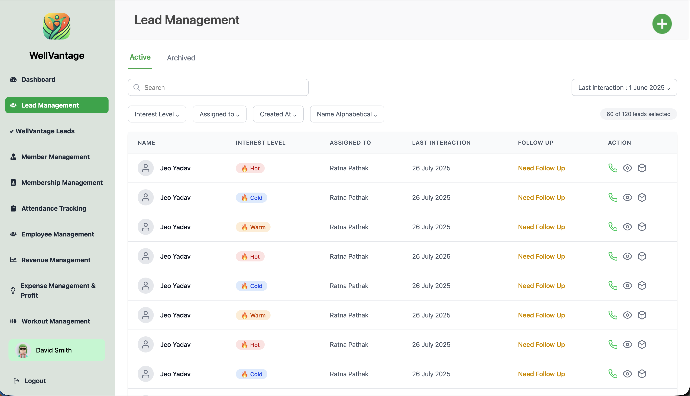
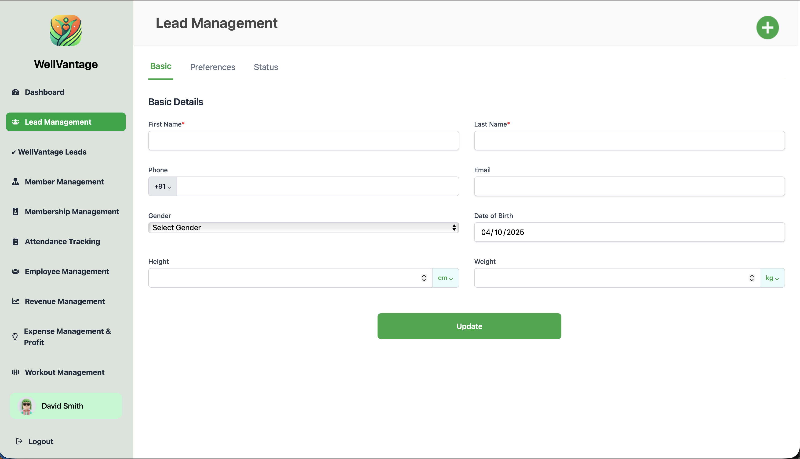
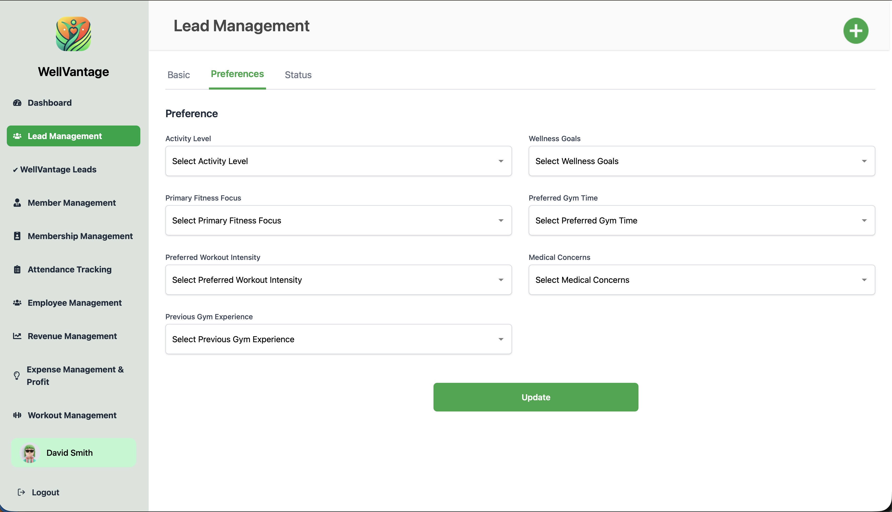

# WellVantage Lead Management System

## Overview
WellVantage is a modern web application designed for managing gym leads, members, and business operations. The project demonstrates a full-featured dashboard for gym management, including lead tracking, member management, attendance, revenue, expenses, and workout management. The UI is built for clarity, speed, and ease of use.

## Features
- **Sidebar Navigation**: Quick access to all major modules (Dashboard, Lead Management, Member Management, Attendance, Revenue, Expenses, Workout, etc.)
- **Lead Management**: Add, view, and filter leads. Tabs for Basic Details, Preferences, and Status.
- **Mock API Integration**: Lead data is fetched asynchronously to simulate real API calls.
- **Reusable Components**: Includes custom InputField, SelectField, DateField, and ActionIcons for consistent UI.
- **Status & Preferences Forms**: Capture detailed information about leads, including activity level, wellness goals, medical concerns, and custom notes.
- **Leads Table**: Paginated, sortable table with action icons for WhatsApp, view, and more.
- **Responsive Design**: Built with Tailwind CSS for a clean, responsive layout.
- **Profile & Logout**: Sidebar includes user profile and logout button.

## Tech Stack
- **React** (with hooks)
- **Vite** (for fast development and build)
- **React Router** (for navigation)
- **React Icons** (for sidebar and action icons)
- **Tailwind CSS** (for styling)
- **Mock API** (using useEffect and useState)

## Folder Structure
```
public/
  logo.png
  container.svg
  Vector.png
src/
  components/
    Sidebar.jsx
  pages/
    LeadManagement.jsx
    Home.jsx
  App.jsx
  main.jsx
  App.css
  index.css
```

## Screenshots

Below are sample screenshots of the application:








## How to Run
1. **Install dependencies**:
   ```sh
   npm install
   ```
2. **Start the development server**:
   ```sh
   npm run dev
   ```
3. **Open in browser**: Navigate to `http://localhost:5173` (or as shown in terminal)

## Usage
- Use the sidebar to navigate between modules.
- In Lead Management, add new leads, view details, and update status/preferences.
- All lead data is loaded from a mock API (simulated with setTimeout).
- The UI is fully responsive and works on desktop and mobile.

## Customization
- To add more modules, create new pages/components and add them to the sidebar.
- To connect to a real API, replace the mock API logic in `LeadsTable` with actual fetch calls.

## Author & License
Developed by Sarthak Dubey for company assignment, October 2025.

MIT License.
